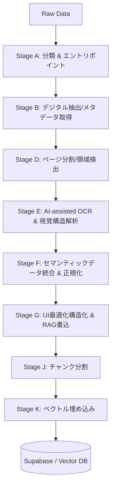

# Document Management System

## This project is NOT a runnable web app.

- Running `python app.py` does **NOT** execute any document processing.
- Web APIs are **read-only / enqueue-only** and NEVER perform processing.
- All processing is executed **exclusively by the Worker** via DB instructions.

---

## Architecture（多層構造のパイプライン）



**Rule**: Web = enqueue/search only. Worker = processing only (Stages A-K).

---

## Operational Flow

### Step 1: DB にリクエスト投入
`services/doc-processor/app.py` または SQL でリクエストを登録します。

```sql
INSERT INTO ops_requests (request_type, scope_type, scope_id, requested_by)
VALUES ('process_document', 'document', 'xxx-uuid', 'admin');
```

### Step 2: Worker 実行
Worker が `pipeline_manager.py` を通じて全ステージを順次実行します。

### Step 3: 検索
`services/doc-search` が `10_ix_search_index` に対してハイブリッド検索を実行します。

---

## Project Structure

```
├── shared/
│   └── pipeline/
│       ├── stage_a/              # A: 分類 (A3EntryPoint)
│       ├── stage_b/              # B: デジタル抽出 (B1Controller)
│       ├── stage_d/              # D: 領域検出 (D1Controller)
│       ├── stage_e/              # E: AI-OCR (E1Controller)
│       ├── stage_f/              # F: データ統合 (F1Controller)
│       ├── stage_g/              # G: UI/RAG構造化 (G1Controller)
│       ├── stage_j_chunking.py   # J: チャンク化
│       └── stage_k_embedding.py  # K: ベクトル化
│
├── services/
│   ├── doc-processor/            # 管理・運用API(Enqueueのみ)
│   └── doc-search/               # 検索専用API
```

---

## Pipeline Stages Specification

| Stage | 名称 | 役割の詳細 |
|:---:|---|---|
| **A** | **Classification** | ファイル種別・ソースの判定。 |
| **B** | **Digital Extraction** | PDF/Mailから直接テキスト・メタデータを抽出。 |
| **D** | **Segmentation** | ページのセグメンテーション、表領域の検出。 |
| **E** | **AI-OCR & Structure** | **核心。** TesseractとGemini Visionを組み合わせた視覚的構造の抽出（表・段落）。 |
| **F** | **Fusion & Normalization** | デジタルと視覚情報の統合、日付のISO 8601正規化、表の論理結合。 |
| **G** | **UI/RAG Optimization** | UI表示用データの確定、AIによる要約・タスク抽出、統合テーブル書込。 |
| **J** | **Chunking** | メタデータを保持した検索用チャンクの生成。 |
| **K** | **Embedding** | ベクトル化と `10_ix_search_index` への保存。 |

---

## Troubleshooting

| 症状 | 原因 | 対処 |
|---|---|---|
| Worker が動かない | SUPABASE_KEY が anon key | Service Role Key に変更 |
| 検索結果 0件 | search_index が空 | Worker 実行を確認 |
| API エラー | GOOGLE_API_KEY 未設定 | .env を確認 |

---

## Security

- Service Role Key は厳重管理
- `.env` は `.gitignore` に追加
- 本番は `debug=False`
