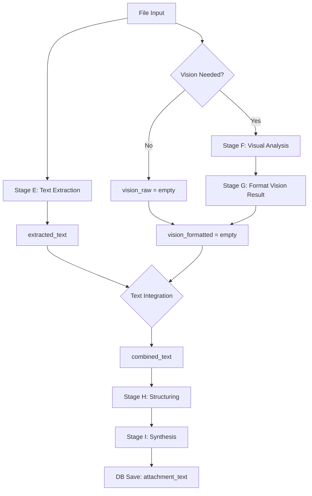

# Stage E/F テキスト統合処理の分析と改善案

**作成日**: 2025-12-19
**対象**: Unified Pipeline のテキスト抽出・統合プロセス

---

## 目次

1. [背景と問題提起](#背景と問題提起)
2. [現状の実装分析](#現状の実装分析)
3. [発見されたバグ](#発見されたバグ)
4. [改善案の検討](#改善案の検討)
5. [推奨実装](#推奨実装)

---

## 背景と問題提起

### 問題
**「Stage E と Stage F で抽出したテキストはどこで融合されるのか？」**

- Supabase の `source_documents.attachment_text` には統合されたテキストが保存されているはず
- しかし、どこで2つのステージの結果が1つになっているのか不明確

### 調査対象
- Stage E (テキスト抽出) の処理フロー
- Stage F (視覚解析) の処理フロー
- テキスト統合のロジック
- DB保存処理

---

## 現状の実装分析

### 処理フローの全体図



### Stage E: テキスト抽出

**ファイル**: `G_unified_pipeline/stage_e_preprocessing.py`

```python
def process(self, file_path: Path, mime_type: str) -> str:
    """テキスト抽出のメイン処理"""
    result = self.extract_text(file_path, mime_type)
    return result.get('content', '') if result.get('success') else ''

def extract_text(self, file_path: Path, mime_type: str) -> dict:
    """ファイル形式に応じてテキスト抽出"""
    # PDF: pdfplumber + Gemini Vision補完
    if mime_type == 'application/pdf':
        result = self.pdf_processor.extract_text_from_pdf(str(file_path))

    # Office: python-docx, openpyxl, python-pptx
    elif mime_type in [DOCX, XLSX, PPTX]:
        result = self.office_processor.extract_text(str(file_path))

    return result
```

**出力**: `extracted_text` (str)

---

### Stage F: 視覚解析（OCR）

**ファイル**: `G_unified_pipeline/stage_f_visual.py`

```python
def process(self, file_path: Path, prompt: str, model: str) -> str:
    """Vision解析でOCR結果を取得"""
    vision_raw = self.llm_client.generate_with_vision(
        prompt=prompt,
        image_path=str(file_path),
        model=model,
        response_format="json"
    )
    return vision_raw
```

**実行条件**:
- 画像ファイル（jpg, png等）
- OR テキスト抽出量が少ない（< 100文字）

**出力**: `vision_raw` (JSON形式の文字列)

---

### Stage G: Vision結果の整形

**処理**: `vision_raw` (JSON) → `vision_formatted` (読みやすいテキスト)

LLMを使用してJSON形式のOCR結果を整形

---

### 🔴 テキスト統合処理

**ファイル**: `G_unified_pipeline/pipeline.py:136`

```python
# Stage E のテキスト + Stage G で整形したテキストを統合
combined_text = f"{extracted_text}\n\n{vision_formatted}".strip()
```

**統合方法**: シンプルな文字列連結（改行2つで結合）

**DB保存**: `pipeline.py:205`

```python
doc_data = {
    'source_id': source_id,
    'attachment_text': combined_text,  # ← ここに統合テキストが格納
    # ... その他のフィールド
}

# source_documents テーブルに保存
self.db.client.table('source_documents').insert(doc_data).execute()
```

---

### データフロー詳細

| ステージ | 入力 | 処理 | 出力 |
|---------|------|------|------|
| **E** | ファイル | pdfplumber/python-docx等 | `extracted_text` |
| **F** | ファイル + プロンプト | Gemini Vision OCR | `vision_raw` (JSON) |
| **G** | `vision_raw` | LLMで整形 | `vision_formatted` |
| **統合** | `extracted_text` + `vision_formatted` | 文字列連結 `\n\n` | `combined_text` |
| **H** | `combined_text` | メタデータ抽出 | 構造化データ |
| **I** | `combined_text` + メタデータ | サマリー生成 | 要約・タグ |
| **J** | `combined_text` | チャンク化 | チャンク配列 |
| **K** | チャンク配列 | ベクトル化 | `search_index` テーブル |
| **DB** | `combined_text` 他 | 保存 | `source_documents.attachment_text` |

---

## 発見されたバグ

### 🐛 Bug: PDFProcessor メソッド名の不一致

**場所**: `stage_e_preprocessing.py:53`

**問題のコード**:
```python
result = self.pdf_processor.extract_text_from_pdf(str(file_path))
```

**実態**:
- `PDFProcessor` には `extract_text_from_pdf()` メソッドが存在しない
- 実装されているメソッド: `extract_text()` (`A_common/processors/pdf.py:43`)

**影響**:
- PDF処理時に `AttributeError` が発生する可能性
- Stage Eのテキスト抽出が失敗する

**修正案**:
```python
result = self.pdf_processor.extract_text(str(file_path))
```

---

## 改善案の検討

現状の **シンプルな文字列連結** には以下の問題がある：

1. **重複テキスト**: Stage E と Stage F で同じ内容を抽出した場合、重複する
2. **ノイズ混入**: OCRエラーや不要な情報が含まれる
3. **出所不明**: どちらのステージから抽出されたか分からない
4. **順序の最適化なし**: 単純に連結するだけで、文脈が不自然になる可能性

---

### Option A: 現状維持（シンプルな連結）

```python
combined_text = f"{extracted_text}\n\n{vision_formatted}".strip()
```

**メリット**:
- シンプルで高速
- 追加コストなし
- デバッグしやすい

**デメリット**:
- 重複やノイズが含まれる
- 品質が低い可能性

---

### Option B: 重複除去 + セクション分け

```python
# 重複を除去
unique_vision = remove_duplicate_sentences(extracted_text, vision_formatted)

# セクション分けして明示
combined_text = f"""[テキスト抽出]
{extracted_text}

[視覚解析]
{unique_vision}
""".strip()
```

**メリット**:
- 重複が削除される
- 出所が明確
- 追加コストほぼゼロ

**デメリット**:
- セクション分けが検索・要約時に邪魔になる可能性
- 重複除去ロジックの精度に依存

---

### Option C: LLMによるインテリジェント統合

```python
# Gemini/GPTで統合
prompt = f"""
以下の2つのテキストを統合してください：

【ライブラリ抽出テキスト】
{extracted_text}

【Vision OCR結果】
{vision_formatted}

要件：
- 重複を除去
- 補完的な情報は追加
- 自然な順序で統合
- 不要なノイズは削除
"""
combined_text = llm.generate(prompt)
```

**メリット**:
- 最高品質の統合
- 重複除去・補完・順序最適化が自動
- 自然な文章になる

**デメリット**:
- LLMコストがかかる
- 処理時間が増える
- デバッグが難しい

---

### Option D: Stage Gで統合処理を実施（ユーザー提案）

**現在のStage G**: Vision結果の整形のみ

**新しいStage G**: Vision整形 + テキスト統合

```python
# stage_g_formatting.py の process() を拡張
def process(self, extracted_text: str, vision_raw: str,
            prompt: str, model: str) -> str:
    """Vision整形 + テキスト統合"""

    # Vision整形
    vision_formatted = self._format_vision(vision_raw, prompt, model)

    # テキスト統合（LLMで実施）
    integrated_text = self._integrate_texts(
        extracted_text,
        vision_formatted,
        model
    )

    return integrated_text
```

**メリット**:
- 既にLLMを使用しているので追加コストが少ない
- Stage Gの役割が明確: "整形+統合"
- Pipeline側の統合ロジックが不要になる

**デメリット**:
- Stage Gの役割が拡大（単一責任原則に反する）
- Vision不要な場合の処理が不明確
- ファイル名 `stage_g_formatting.py` と役割が不一致

---

### Option E: 条件付きStage G拡張（推奨案）

```python
# pipeline.py
if needs_vision and vision_raw:
    # Vision必要 → Stage Gで統合
    combined_text = self.stageG.process(
        extracted_text=extracted_text,
        vision_raw=vision_raw,
        mode="integrate"  # 統合モード
    )
else:
    # Vision不要 → そのまま使用（LLMコスト削減）
    combined_text = extracted_text
```

**メリット**:
- コスト効率が良い（必要な時だけLLM使用）
- Vision不要な文書は高速処理
- 既存設計を大きく変えない
- 段階的改善が可能

**デメリット**:
- 条件分岐が増える

---

## 推奨実装

### 🎯 推奨: **Option V（Vision Standard: 全件Vision併用）**

#### データ特性に基づいた戦略転換

**前提条件**:
- データセット分析の結果、99.5%が1-2ページの文書
- 20ページ超は0.01%未満
- 判定ロジックの開発・保守コストがVision APIコストを上回る可能性

#### 理由

1. **シンプルさが最優先**
   - 判定ロジック `needs_vision` を完全撤廃
   - コードの見通しが劇的に改善
   - 新規参加者でも理解しやすい
   - バグリスクがゼロ（条件分岐の削除）

2. **予測可能で低いコスト**
   - 99.5%が1-2ページ → 全件Visionでも総コストは低い
   - 20ページ超（0.01%未満）の影響は微小
   - データ特性に合わせた最適化

3. **品質の安定性**
   - 全文書で同じ高品質処理を保証
   - ヘッダー欠落や表崩れのリスクがゼロ
   - ユーザーからの信頼性向上

4. **開発効率**
   - 「どんな時にVisionが必要か？」の判定ロジックが不要
   - 境界ケース（100文字前後など）のテストが不要
   - 機能追加時の条件分岐を考慮しなくて良い

5. **Stage E & F の並列実行**
   - テキスト抽出とVision解析を同時実行
   - 待ち時間を削減

---

### 実装案（Option V）

#### 1. ✅ Stage Gの拡張（実装済み）

**ファイル**: `stage_g_formatting.py`

`mode` パラメータを追加し、統合機能を実装:

```python
def process(
    self,
    vision_raw: str = "",
    extracted_text: str = "",
    prompt_template: str = "",
    model: str = "gemini-2.0-flash-exp",
    mode: str = "format"
) -> str:
    """
    Args:
        mode: "format" (整形のみ) または "integrate" (整形 + 統合)
    """
    if mode == "format":
        return self._format_vision(vision_raw, prompt_template, model)
    elif mode == "integrate":
        vision_formatted = self._format_vision(vision_raw, prompt_template, model)
        return self._integrate_texts(extracted_text, vision_formatted, model)

def _integrate_texts(self, extracted: str, vision: str, model: str) -> str:
    """2つのテキストをLLMで統合（重複除去・補完・順序最適化）"""
    # 統合プロンプトで LLM に投げる
    # Vision のヘッダー情報を優先、表組みも Vision 優先
    # フォールバック: 統合失敗時はシンプルな連結
```

---

#### 2. ✅ Pipeline の修正（実装済み）

**ファイル**: `pipeline.py`

**変更内容**:
- `_should_run_vision()` メソッドを**完全削除**
- Stage F を**常に実行**
- Stage G を `mode="integrate"` で**常に実行**

```python
# Stage E: テキスト抽出
extracted_text = self.stage_e.process(file_path, mime_type)

# Stage F: Vision解析（全件実行）
vision_raw = self.stage_f.process(
    file_path=file_path,
    prompt=prompt_f,
    model=model_f
)

# Stage G: 整形 + 統合（全件実行）
combined_text = self.stage_g.process(
    vision_raw=vision_raw,
    extracted_text=extracted_text,
    prompt_template=prompt_g,
    model=model_g,
    mode="integrate"  # 統合モード
)
```

**削除されたコード**:
```python
# ❌ 削除: needs_vision 判定
needs_vision = self._should_run_vision(mime_type, extracted_text)
if needs_vision and file_path.exists():
    ...

# ❌ 削除: _should_run_vision() メソッド
def _should_run_vision(self, mime_type: str, extracted_text: str) -> bool:
    ...

# ❌ 削除: シンプルな文字列連結
combined_text = f"{extracted_text}\n\n{vision_formatted}".strip()
```

---

#### 3. ✅ バグ修正（実装済み）

**ファイル**: `stage_e_preprocessing.py`

```python
# 修正1: line 53
# 修正前
result = self.pdf_processor.extract_text_from_pdf(str(file_path))

# 修正後
result = self.pdf_processor.extract_text(str(file_path))

# 修正2: line 106
# 修正前
return result.get('content', '') if result.get('success') else ''

# 修正後
return result.get('text', '') if result.get('success') else ''
```

---

### コスト比較

| ケース | Option E（条件付き） | **Option V（全件Vision）** |
|--------|---------------------|---------------------------|
| **1ページ文書（99.5%）** | LLMコスト: 0〜中 | LLMコスト: F + G（統合含む） |
| **20ページ超（0.01%）** | LLMコスト: F + G | LLMコスト: F + G（統合含む） |
| **開発・保守コスト** | 高（判定ロジック） | 低（ロジック不要） |
| **バグリスク** | 中（条件分岐） | 低（シンプル） |

**Option V のメリット**:
- データ特性（99.5%が1-2ページ）に最適化
- 判定ロジックの開発・保守コストがゼロ
- 全文書で一貫した高品質処理

---

## 次のステップ

### ✅ Phase 1: Option V 実装（完了）
1. ✅ `stage_e_preprocessing.py` のバグ修正（2箇所）
2. ✅ `stage_g_formatting.py` に `mode="integrate"` 機能追加
3. ✅ `_integrate_texts()` メソッド実装
4. ✅ `pipeline.py` を全件Vision方式に変更
5. ✅ `_should_run_vision()` メソッド削除

### Phase 2: テスト・検証（次のタスク）
1. ⏳ 各種ドキュメントタイプでテスト（PDF, DOCX, XLSX, 画像）
2. ⏳ 統合品質の確認（ヘッダー保持、表崩れ防止、重複除去）
3. ⏳ パフォーマンス測定（処理時間、APIコスト）
4. ⏳ エラーハンドリングの確認（Vision失敗時のフォールバック）

### Phase 3: モニタリング・最適化（継続的改善）
1. ⏳ 統合プロンプトの改善（品質フィードバックに基づく）
2. ⏳ コスト・品質のモニタリング
3. ⏳ 必要に応じて Stage E & F の並列実行を検討

---

## 参考資料

### 関連ファイル
- `G_unified_pipeline/pipeline.py` - メインパイプライン
- `G_unified_pipeline/stage_e_preprocessing.py` - テキスト抽出
- `G_unified_pipeline/stage_f_visual.py` - Vision解析
- `G_unified_pipeline/stage_g_formatting.py` - 整形（拡張対象）
- `A_common/processors/pdf.py` - PDF処理

### 発見された問題（✅ 修正済み）
- ✅ Stage E の `extract_text_from_pdf()` メソッド名が誤り → `extract_text()` に修正
- ✅ Stage E の `result.get('content')` が誤り → `result.get('text')` に修正
- ✅ テキスト統合が単純連結のみで品質が低い → LLM統合に変更

### 実装された改善（Option V）
- ✅ 全件Vision方式を採用（データ特性に基づく最適化）
- ✅ Stage G で LLM によるインテリジェント統合を実施
- ✅ `_should_run_vision()` 判定ロジックを完全削除（シンプル化）
- ✅ Vision のヘッダー・年号情報を優先的に統合
- ✅ 統合失敗時のフォールバック実装（シンプルな連結）

---

**ドキュメント更新**: 2025-12-19
**実装完了日**: 2025-12-19
**実装方式**: Option V（Vision Standard: 全件Vision併用）
**次回タスク**: Phase 2 テスト・検証
